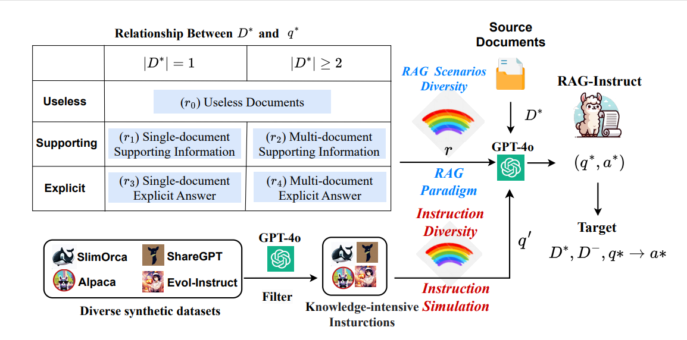

# RAG-Instruct: Boosting LLMs with Diverse Retrieval-Augmented Instructions
<div align="center">
<h3>
  RAG-Instruct
</h3>
</div>

<!-- <p align="center">
📃 <a href="assets/paper.pdf" target="_blank">Paper</a> ｜🤗 <a href="https://huggingface.co/FreedomIntelligence/HuatuoGPTo1-7B" target="_blank">HuatuoGPT-o1-7B</a> ｜🤗 <a href="https://huggingface.co/FreedomIntelligence/HuatuoGPT-o1-8B" target="_blank">HuatuoGPT-o1-8B</a> ｜ 🤗 <a href="https://huggingface.co/FreedomIntelligence/HuatuoGPT-o1-70B" target="_blank">HuatuoGPT-o1-70B</a>  | 📚 <a href="https://huggingface.co/datasets/FreedomIntelligence/medical-o1-reasoning-SFT" target="_blank">Data</a>
</p> -->


## ⚡ Introduction
Hello! Welcome to the repository for [RAG-Instruct](assets/paper.pdf)!

<div align=center>

</div>


**RAG-Instruct** is a method for generating diverse and high-quality RAG instruction data. It synthesizes instruction datasets based on any source corpus, leveraging the following approaches:

- **Five RAG paradigms**, which represent diverse query-document relationships to enhance model generalization across tasks.
- **Instruction simulation**, which enriches instruction diversity and quality by utilizing the strengths of existing instruction datasets.

Using this approach, we constructed a 40K instruction dataset from Wikipedia, covering a wide range of RAG scenarios and tasks.

We open-sourced our models, data, and code here.

## 👨‍⚕️ Model
- **Model Access**

<!-- |                      | Backbone     | Supported Languages | Link                                                                  |
| -------------------- | ------------ | ----- | --------------------------------------------------------------------- |
| **HuatuoGPT-o1-8B**  | LLaMA-3.1-8B  | English    | [HF Link](https://huggingface.co/FreedomIntelligence/HuatuoGPT-o1-8B) |
| **HuatuoGPT-o1-70B** | LLaMA-3.1-70B | English    | [HF Link](https://huggingface.co/FreedomIntelligence/HuatuoGPT-o1-70B) |
| **HuatuoGPT-o1-7B**  | Qwen2.5-7B   | English & Chinese | [HF Link](https://huggingface.co/FreedomIntelligence/HuatuoGPT-o1-7B) |
| **HuatuoGPT-o1-72B** | Qwen2.5-72B  | English & Chinese | [HF Link](https://huggingface.co/FreedomIntelligence/HuatuoGPT-o1-72B) | -->

- **Deploy**

RAG-Instruct can be used just like `Llama-3.1-8B-Instruct`. You can deploy it with tools like [vllm](https://github.com/vllm-project/vllm) or [Sglang](https://github.com/sgl-project/sglang),  or perform direct inference:
```python
from transformers import AutoModelForCausalLM, AutoTokenizer

model = AutoModelForCausalLM.from_pretrained("FreedomIntelligence/RAG-Instruct-Llama3.1-8B",torch_dtype="auto",device_map="auto")
tokenizer = AutoTokenizer.from_pretrained("FreedomIntelligence/RAG-Instruct-Llama3.1-8B")

input_text = "How to stop a cough?"
messages = [{"role": "user", "content": input_text}]

inputs = tokenizer(tokenizer.apply_chat_template(messages, tokenize=False,add_generation_prompt=True
), return_tensors="pt").to(model.device)
outputs = model.generate(**inputs, max_new_tokens=2048)
print(tokenizer.decode(outputs[0], skip_special_tokens=True))
```


## 📚 Data
### Data Access

| Data                  | Description                                                                                   | Link                                                                                           |
| -------------------------- | ----------------------------------------------------------------- | --------------------------------------------------------------------------------------------- |
| RAG-Instruct (Wikipedia) | Diverse RAG instruction data built based on Wikipedia corpus | [Link](https://huggingface.co/datasets/FreedomIntelligence/medical-o1-verifiable-problem)  |

### Data Construction

We provide scripts to construct verifiable problems and searching reasoning paths.

**1. Download Source Documents.** 
We utilize preprocessed passage data from DPR and embeddings generated using Contriever-MSMARCO:

- Download the preprocessed passage data:
  ```bash
  cd retrieval_lm
  wget https://dl.fbaipublicfiles.com/dpr/wikipedia_split/psgs_w100.tsv.gz
  ```
  
- Download the generated embeddings:
  ```bash
  wget https://dl.fbaipublicfiles.com/contriever/embeddings/contriever-msmarco/wikipedia_embeddings.tar
  ```

**2. Download Exemplar Datasets.** 
We utilize preprocessed passage data from DPR and embeddings generated using [Contriever](https://github.com/facebookresearch/contriever) :

We utilize several high-quality datasets as exemplars, including:

- [ShareGPT](https://huggingface.co/datasets/anon8231489123/ShareGPT_Vicuna_unfiltered)
- [Alpaca](https://github.com/tatsu-lab/stanford_alpaca)
- [WizardLM-70K](https://huggingface.co/datasets/WizardLM/WizardLM_evol_instruct_V70K)
- [Lmsys-chat-1M](https://huggingface.co/datasets/lmsys/lmsys-chat-1m)
- [SlimOrca](https://huggingface.co/datasets/Open-Orca/OpenOrca)

To ensure high-quality data, we filtered and sampled these datasets using GPT-4 to extract **knowledge-intensive data**. For user convenience, we provide the **preprocessed and filtered exemplar dataset [here](https://example.com/preprocessed-exemplar-dataset)** that has undergone this rigorous selection process.

**3. Retrieve Source Documents for Exemplar Data.**
Using the exemplar dataset Q, we retrieve source documents to construct D*. Specifically, we match the exemplar instructions or questions with source documents by ranking their relevance. 

**4. Synthesize Data with Prompts.**
Based on the retrieved documents D* and the exemplar data Q, we synthesize new data points using tailored prompts to create diverse and high-quality instruction-following datasets.


## 🚀 Training

### **Run Retriever**
To retrieve passages for training, use the following command:

```bash
cd retrieval_lm
python passage_retrieval.py \
    --model_name_or_path facebook/contriever-msmarco \
    --passages psgs_w100.tsv \
    --passages_embeddings "wikipedia_embeddings/*" \
    --data RAG_INSTRCT_DATA_PATH \
    --output_dir YOUR_OUTPUT_FILE \
    --n_docs 250
```
The input file must be in `json` or `jsonl` format. Each instance should include either a `question` or `instruction` field, which will be used as the query during retrieval.

### **Finetuning based on RAG-instruct**

Fine-tune the model on an 8-GPU setup:
```bash
 accelerate launch --config_file ./configs/sft.yaml \
    --num_processes 8  \
    --num_machines 1 \
    --machine_rank 0 \
    --main_process_port 29502 \
    --deepspeed_multinode_launcher standard train_rag_sft4.py \
    --experiment_name RAG-Instruct-Llama3.1-8b \
    --model_path ./models/Llama-3.1-8B \
    --max_ckpts 2  \
    --max_seq_len 4096 \
    --gradient_accumulation_steps 16 \
    --data_path data_path \
    --output_dir ./ckpts \
    --log_dir ./train_logs \
    --n_epochs 3 \
    --warmup_rates 0.05 \
    --train_bsz_per_gpu 1 \
    --eval_bsz_per_gpu 64 \
    --learning_rate 5e-6 \
    --gradient_checkpointing
```

## 🔥 Inference

- **Inference**

## 📖 Citation
```

```
